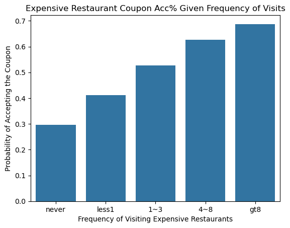
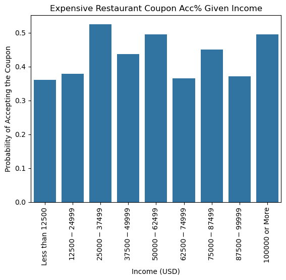
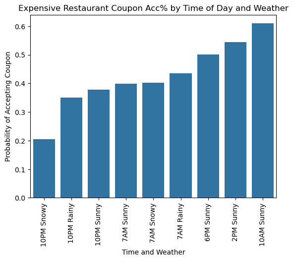

# Practical Application 1: Will the Customer Accept the Coupon?

## Introduction
In this assignment, we were given a dataset regarding drivers who were given coupons through their mobile phones to various establishments (bars, restaurants, etc.) We were given a bunch of interesting information about these drivers, and then told whether each specific driver accepted the offered coupon or not. Our task is to delve in to the data and try to figure out what demographic and situational data makes a driver more or less likely to accept a particular coupon.

## Part 1: Overview

First, we looked to get a basic overview of the data. There were five different types of coupons offered:

## Part 2: Investigating Bar Coupons

Unsurprisingly, the strongest predictor of accepting a bar coupon seems to be whether the driver frequently visits bars. Frequent bar visitors accepted the bar coupon 77% of the time, while drivers who infrequently or never visit bars accepted the bar coupon only 37% of the time.

Interestingly, relatively low income drivers who often visit cheap restaurants only accepted the coupon 60% of the time, which is lower than I expected. If we split this group into frequent vs. infrequent bar visitors, the results are surprising:

Acceptance rate for this group who are infrequent bar visitors: 58.8%

Acceptance rate for this group who are frequent bar visitors: 65.94%

Among this group, frequent bar visitors accepted the bar coupon at a 66% rate, lower than the overall rate for frequent bar visitors (77%). This is a bit strange. However, infrequent bar visitors in this group accepted the bar coupon at a 59% rate, much higher than the 37% overall rate for infrequent bar visitors. This suggests that both low income and frequently visiting cheap restaurants make a driver more likely to accept a bar coupon, at least in the case where they are not frequent bar visitors.

The effect of marital status and occupation are unclear, but seem marginal at best.

## Part 3: Investigating Expensive Restaurant Coupons

Here, I want to investigate the characteristics of drivers who accept a coupon for an expensive restaurant. I would expect to see significant differences between this group and the group that accepted bar coupons, but let's see what the data says.

Unsurprisingly, we see that frequently visiting expensive restaurants is a strong predictor of accepting the expensive restaurant coupon. Drivers who visit expensive restaurants 4 or more times per month were more than twice as likely to accept the coupon as drivers who never visit expensive restaurants.

I am also interested to see how income affects the acceptance of this coupon. We can make a similar graph to investigate this:

The results here are certainly surprising: there is not a clear trend relating income to coupon acceptance. Low income drivers (less than $25k) accept the coupon the least. But the group that accepts the coupon at the highest rate is drivers between $25k and $37.5k. Perhaps these drivers have enough financial means that they feel they can go to an expensive restaurant as a special treat if they get a discount, like the offered coupon.

There is another spike for very high income drivers, who presumably frequent expensive restaurants the least. If I was targeting these coupons based on income, these are the two groups I would target.

For the final part of my investigation into the expensive restaurant coupons, I want to see how time of day and weather affects acceptance rates. One would expect that drivers would be more likely to accept coupons in the evening, however, this affect may be small if drivers are willing to hold onto the coupon. I am not sure how large this effect will be, so I want to investigate it. One might also expect that inclement weather will make drivers less likely to accept the coupon.

This result is very interesting - customers accept the coupon early in the day at high rates. And, indeed, bad weather is a strong deterrent to accepting the coupon. My recommendation would be to not ever send coupons when it is snowing. Additionally, the best time to send drivers an expensive restaurant coupon seems to be around 10am; acceptance rates fall off slightly at 2pm and more at 6pm, but are much lower at 7am.

So, in conclusion, I would suggest sending expensive restaurants coupons in the late morning on days with nice weather, and especially targeting drivers who say they frequent expensive restaurants. Given the importance of these results and the relatively inconclusive data regarding income, I would not recommend using income as an important factor for this decision.